# PixelSnake

## Reinforcement Learning Re-evaluation and Ultimate Control

Technical report for research-supervisor review

Experiment series: full_recheck_2026_09_15

Frozen-model evaluation, controller failure analysis, regression testing and reproducible artifacts

### Scope and evidence

This report examines the implemented browser and Python system, preserves its original experiment history, and evaluates unchanged learned checkpoints. It distinguishes raw learned behavior from privileged full-board planning and deterministic ordered control. Every reported fresh performance statistic is derived from saved episode records.

### Principal findings

- Raw evaluation: 1,200 episodes across four policies and three matched evaluation seed blocks.
- Browser assistance: 160 episodes across eight policy/assistance conditions.
- Ultimate matched regression: 9/20 full-board wins before the fix and 20/20 after it.
- Validation: 64 Python and 97 JavaScript tests per full pass, three consecutive clean passes, plus extra deterministic regressions.
- Remaining limitation: bounded recovery is not guaranteed for arbitrary dense states; synchronous search can pause the browser.

Implementation reference: `0f443f177ee00b666b17906aca6a9b41b69f1672`

Repository: https://github.com/GamERs-007/PixelSnakeAIAgent-Training.git

Prepared from repository source and recorded experiments. No new training or Qwen run was performed.

<!-- pagebreak -->

# Abstract and reading guide

## Abstract

PixelSnake combines an interactive JavaScript Snake game with a numeric Gymnasium environment, a small PyTorch DQN and optional full-board planning. This re-evaluation examines four raw policies on 300 episodes each. Random, Heuristic, Classic DQN and Strategy DQN achieved mean scores of 1.23, 279.97, 276.07 and 291.90, respectively. The paired Strategy-minus-Classic mean difference was 15.83, with a 95% bootstrap interval [-1.80, 33.83]. Thus the measured score difference does not establish a reliable general advantage for Strategy on these fixed checkpoints. Strategy exhibited fewer turns, but had additional historical training.

A separate browser experiment evaluated optional planning with 20 seeds per condition. Ultimate's dense-board failure was reproduced in 11 of 20 original-controller runs: each stalled while recovering toward the intended ordering, rather than after valid ordered lock. The repair searches moving-body configurations, validates cached execution and replans immediately when food growth changes the state. The repaired controller completed all 20 tested episodes without recorded recurrence, collision or ordered-index error. These seeds informed development; the result is regression evidence rather than an unbiased holdout win-rate estimate.

## Organization

The report first establishes implementation and environment contracts, then describes DQN, shaping and planning. The controller analysis explains the failure mechanism and its bounded repair. Subsequent sections present protocols, raw and assisted results, statistics, negative evidence, test coverage and reproducibility. Historical training and Qwen results are explicitly separated from the fresh evaluation. The appendix lists commands, model hashes and machine-readable artifacts.

## Source convention

Code paths are relative to the repository root. Fresh results reside under `results/full_recheck_2026_09_15/`. Tables are generated from `summary.json`, which is itself recomputed from raw CSV/JSON. Source filenames/functions identify implementation claims; historical claims cite original artifacts. References provide conceptual context and do not replace implementation evidence.

<!-- pagebreak -->

# 1. Introduction and system background

## Engineering objective

The project provides an interactive environment in which human, random, heuristic, learned and locally prompted agents can control the same Snake engine. The research question for this recheck is narrower than solving Snake in general: what behavior do the saved learned policies exhibit under matched evaluation conditions, and can the existing dense-board controller's observed recovery loops be prevented without changing the observation vector, network or checkpoint weights?

Three evidence layers must be kept distinct. Raw policies receive the compact observation. The browser safety planner observes the entire board and may override any AI policy. Ultimate adds a dense-board ordering objective to this planner. High performance of the combined system therefore cannot be attributed solely to reinforcement learning. [Source: `SnakeEnv._observation`; `AssistedAgent.chooseAction`; `SafetyGuard.choose`.]

## Original baseline and preservation

The original DQN experiment used 2,000 episodes, seed 42, CPU training and the classic reward. Its recorded duration was 39.8630 seconds, covering 170,682 environment steps and 42,421 optimizer updates. The original evaluation achieved mean score 306.30 on 100 seeds beginning at 200000. Strategy was subsequently continued for 300 episodes. These are historical records, not rerun training measurements. [Source: `results/run_config.json`, `training_status.json`, `evaluation.json`; `results/strategy_v1_experiment/comparison.json`.]

The original README is preserved verbatim under `baseline/README.md`. Hashes recorded before the work cover all existing result files and active model files. Original GitHub model files were retained in `archive/github-original-models/`, and development variants remain in their earlier migration archive. Neither failed development candidates nor negative experiment results were discarded.

## Version boundary

The recovered Git baseline is `5c956389ba349739b861e8d7970809a28cf6571f`. The actual local project already contained subsequent profile and UI work. The source-before hash manifest therefore defines the controller baseline more precisely than the older Git commit alone. The implementation commit `0f443f177ee00b666b17906aca6a9b41b69f1672` reconciles those existing changes and the recovery repair; it does not represent a fresh training run. [Source: `metadata.json`, `baseline/js/safety.js`, Git history.]

<!-- pagebreak -->

# 2. Architecture and language boundaries

| Source | Implemented responsibility |
| --- | --- |
| `index.html`, `PixelSnake.html`, `css/` | Browser entry points and appearance; matching HTML entry files. |
| `js/game.js`: `SnakeGame`, `getCollisionCause`, `randomGenerator` | Rendering-independent 20x20 engine, state snapshots, food, collision, score and seeded PRNG. |
| `js/agents.js`: `HumanAgent`, `RandomAgent`, `HeuristicAgent` | Queued human input and baseline action policies. |
| `js/episode.js`: `EpisodeRunner`, `runEpisodes` | Shared episode lifecycle and headless execution. |
| `js/safety.js`: `SafetyGuard.choose`, `safeFoodPath`, `joinPlan` | Optional full-board planner and Ultimate recovery / ordered traversal. |
| `js/dqn-agent.js`: `DenseQNetwork`, `BrowserDQNAgent` | Float32 browser forward pass using exported PyTorch weights; no per-move HTTP after loading. |
| `js/local-ai.js`, `js/main.js`, `js/input.js`, `js/renderer.js` | Local-service requests, controller/UI integration, input and Canvas drawing. |
| `rl/snake_env.py`: `SnakeEnv` | Gymnasium numeric environment with classic or Strategy reward. |
| `rl/dqn/model.py`, `agent.py`, `replay_buffer.py` | PyTorch network, vanilla DQN training, uniform replay and checkpoints. |
| `rl/dqn/train.py`, `train_session.py`, `evaluate.py`, `evaluation.py` | Original training, resumable UI jobs, raw baseline evaluation and evaluation helpers. |
| `rl/strategy_reward.py`, `rl/model_profiles.py`, `rl/compare_strategy.py` | Reward shaping, scheme mapping and historical continuation comparison. |
| `rl/llm_agent.py`, `rl/evaluate_llm.py` | Local Ollama text policy, strict output validation and budgeted LLM experiment. |
| `rl/web_server.py`: `LocalApp` | Loopback HTTP server, model exports, Python inference, training subprocesses and status. |
| `scripts/recheck_raw.py`, `evaluate-browser.cjs` | Fresh frozen-model evaluation and browser-protocol telemetry. |
| `scripts/generate_report_figures.py`, `build_recheck_documents.py`, `render_recheck_report.py` | Regenerate statistics, figures, documentation and report from saved data. |
| `tests/`, `rl/test_*.py`, `rl/dqn/test_dqn.py` | JavaScript engine/UI/planner and Python environment/training/API/parity tests. |
| `models/`, `results/`, `archive/`, `reports/` | Active checkpoints, recorded experiments, preserved earlier files and this report. |

The engine exposes detached snapshots and owns simulation state. Policies propose actions; the optional guard may replace them; the runner advances the engine. Python is responsible for the numeric environment, optimization, local inference services and reporting. Browser inference is a separate forward-pass implementation verified against the same exported weights. This modular division supports testing the controller without Canvas and evaluating learned weights without a browser. [Source: `js/game.js`, `js/episode.js`, `js/dqn-agent.js`, `rl/web_server.py`.]

<!-- pagebreak -->

# 3. Environment formulation

The default board is 20 x 20. Reset creates a three-cell snake with head (9,10), facing right; food is sampled uniformly from empty cells. Score increases by 10 per food, independently of training reward. A full board therefore has length 400, 397 foods and score 3,970. [Source: `rl/snake_env.py`, `SnakeEnv.reset`, `_spawn_food`, `step`; `js/game.js`, `SnakeGame`.]

Gymnasium uses `Discrete(3)`: 0 = straight, 1 = left, 2 = right, relative to the current direction. JavaScript uses absolute `UP`, `DOWN`, `LEFT`, `RIGHT`; reversal is excluded from legal policy actions and ignored by the engine when supplied directly. [Source: `SnakeEnv.ACTION_TURNS`; `js/game.js`, `getLegalActions`, `directionFor`.]

The observation is a float32 `Box` of shape (10,). Lower bounds are [0,0,0,0,0,0,0,-1,-1,0]; all upper bounds are 1. Features, in exact order:

| Index | Feature | Definition |
| --- | --- | --- |
| 0 | danger_straight | Next straight move collides, including correct departing-tail handling |
| 1 | danger_left | Next relative-left move collides |
| 2 | danger_right | Next relative-right move collides |
| 3 | direction_up | One-hot current direction |
| 4 | direction_right | One-hot current direction |
| 5 | direction_down | One-hot current direction |
| 6 | direction_left | One-hot current direction |
| 7 | food_dx | (food.x - head.x) / (board_size - 1), or 0 without food |
| 8 | food_dy | (food.y - head.y) / (board_size - 1), or 0 without food |
| 9 | no_food_fraction | min(1, steps_since_food / max_steps_without_food) |

[Source: `rl/snake_env.py`, `SnakeEnv.__init__`, `OBSERVATION_NAMES`, `_observation`; browser equivalent: `js/dqn-agent.js`, `observation`.]

Classic rewards are +10 on food, -10 on collision and -0.01 on ordinary successful movement. They are mutually exclusive on each tick. Wall/self collision or board-full completion is `terminated`; 400 consecutive no-food moves is `truncated` on the default board. Training/raw evaluation runners additionally cap episodes at 10,000 attempted moves. Collisions increment attempted steps but not successful survival steps. Moving into the departing tail is legal on a non-eating step. [Source: `SnakeEnv.step`, `_collision`, `_info`; `rl/dqn/train.py`, `train`; `scripts/recheck_raw.py`, `main`.]

The browser engine has no intrinsic no-food cutoff. Safety evaluation applies a 3,000-step external cap; Ultimate applies a 100,000-step cap and 10,000 no-food cutoff, with a separate 400-step no-food assertion after genuine lock. These different protocols must not be pooled. [Source: `js/game.js`, `SnakeGame.step`; `scripts/evaluate-browser.cjs`, `run`; `protocol.json`.]


The physical board state contains the ordered body and food, but the learner receives only the ten-element projection. Two different bodies can therefore produce the same observation while requiring different longer-term behavior. This is an information limitation of the implemented policy interface, not evidence that a larger network alone would resolve it. [Source: `SnakeEnv._observation`, `get_state`.]

<!-- pagebreak -->

# 4. DQN implementation

The network is `Linear(10,128) -> ReLU -> Linear(128,128) -> ReLU -> Linear(128,3)`, with 18,307 trainable parameters. This is vanilla DQN, not Double DQN, dueling DQN or a recurrent model. The input has no pixels, body coordinates, recurrent memory or image encoder. [Source: `rl/dqn/model.py`, `QNetwork`; `rl/dqn/agent.py`, `DQNAgent.train_batch`.]

| Setting | Actual default | Source |
| --- | --- | --- |
| Replay | 50,000 transitions; uniform sample without replacement | `ReplayBuffer`, `sample` |
| Batch | 64 | `DQNConfig.batch_size` |
| Optimizer | Adam, learning rate 0.0003 | `DQNAgent.__init__` |
| Discount | 0.99 | `DQNConfig.gamma` |
| Exploration | epsilon 1.0 to 0.05, linear over 100,000 environment steps, then fixed | `DQNAgent.epsilon` |
| First learning | at least 1,000 environment steps and sufficient replay | `DQNAgent.observe` |
| Training interval | every 4 environment steps | `DQNConfig.train_every` |
| Target network | hard copy every 500 optimizer updates | `DQNAgent.train_batch` |
| Loss | SmoothL1Loss / Huber | `DQNAgent.__init__` |
| Gradient clipping | global norm 10 | `DQNAgent.train_batch` |
| Device / threads | CPU, one PyTorch thread | `seed_everything` |

The target is `y = r + gamma * (1 - terminated) * max_a Q_target(next_state,a)`. Only the chosen action's online Q-value enters the loss. Truncation continues to bootstrap. Greedy evaluation calls `choose_action(..., explore=False)`. [Source: `rl/dqn/agent.py`, `bellman_targets`, `train_batch`, `choose_action`.]

Checkpoint format 1 stores config, online/target state dicts, optimizer state, counters and metadata. Format 2 additionally stores replay arrays and replay RNG, agent RNG, Torch/Python/NumPy RNG states. `torch.load(..., map_location="cpu", weights_only=True)` restores supported formats; saving uses a temporary file followed by replacement. Format 1 cannot provide exact replay/RNG resume. [Source: `DQNAgent.save`, `load`; `ReplayBuffer.state_dict`, `load_state_dict`.]

UI jobs save dated, microsecond-resolved filenames under `models/classic`, `models/strategy` or `models/ultimate`, including cumulative episodes. Resuming inherits the source training seed; numeric reward changes reset replay. The original trainer saves best validation and latest checkpoints; original filenames are preserved in `archive/github-original-models/`. Browser exports include only supported dense weights and the allowed inference flag. [Source: `rl/dqn/train_session.py`, `train_session.save`; `rl/dqn/train.py`, `train`; `rl/web_server.py`, `LocalApp.browser_model`.]


The implementation uses the replay/target-network design associated with DQN [1], but it learns from engineered numeric features rather than Atari images. Optimizer-step and environment-step counters are explicitly different; a target copy every 500 updates is not every 500 game ticks. The recheck leaves all these choices unchanged. The reports compare frozen snapshots and do not estimate training convergence across seeds.

<!-- pagebreak -->

# 5. Reward schemes and checkpoint interpretation

**Classic** uses the classic rewards and the 2,000-episode frozen checkpoint. **Strategy** maps to `strategy_v1` numeric rewards and the 2,300-episode checkpoint, continued for 300 episodes from the original model. **Ultimate** maps to the same Strategy numeric reward, adding `dense_board_sweep_above_half` at browser inference. The inspected Strategy and Ultimate online tensors are identical; the different checkpoint hashes do not imply independently trained policies. [Source: `rl/model_profiles.py`, `training_reward`, `inference_rules`; checkpoint inspection in `metadata.json`; historical `results/strategy_v1_experiment/comparison.json`.]

Strategy adds `gamma * Phi(next) - Phi(current)` to the base reward. Its potential is `-min(d,2N)/(2N) + 0.25*min(1,A/R) + 0.25*T`, where N is board width, d is static BFS food distance (N*N if unreachable), A is reachable area, T indicates reachable tail and `R=max(1,min(length+1,N*N-length+2))`. Geometry treats the tail as vacating. True terminal next potential is zero; truncated next potential is retained. Additional penalties are -0.005 for a nonterminal turn, -0.05 times min(previous exact-body visits,4) for repeats without eating, and -2 for timeout. Eating resets visit memory. These extra penalties change the objective; the whole reward is not a policy-invariant shaping guarantee. [Source: `rl/strategy_reward.py`, `geometry`, `potential`, `StrategyReward.reward`.]


Potential-based shaping provides a theoretical motivation for the potential difference term [2]. However, turn, repetition and timeout penalties add separate objectives. Moreover, the learned observation is only a projection of the full state on which shaping geometry is computed. This report therefore does not claim that the complete Strategy implementation preserves the original optimal policy.

The fresh comparison evaluates both checkpoints under classic evaluation rewards and identical environment seeds. Score counts foods, so shaped reward cannot inflate the reported score directly. Nevertheless, Classic and Strategy have different training exposure (2,000 versus 2,300 episodes). A controlled causal comparison would train several matched-seed models with equal episode or step budgets. That experiment is future work.

Historical controlled continuation data exist for one source model and 300 added episodes: Classic continuation mean score 269.00 and Strategy continuation 297.20 on seeds 400000-400099. This is retained as historical context and not merged with the fresh seed blocks. [Source: `results/strategy_v1_experiment/comparison.json`; `rl/compare_strategy.py`.]

<!-- pagebreak -->

# 6. Full-board planning and dense control

Assistance sees the entire snake and board. It is privileged planning, separate from the ten-feature learned policy. `safeFoodPath` runs BFS with straight-first tie breaking, simulates the full route against the moving snake, and verifies tail reachability after eating. Cached actions are accepted only while the snake signature and food match. Without a plan, `assess` checks immediate collision, reachable space and tail access; ordinary assistance also uses recent head visits. [Source: `js/safety.js`, `safeFoodPath`, `assess`, `SafetyGuard.choose`.]

Ultimate requests dense control strictly above half occupancy: length >200 on this board. The intended cycle traverses rows while reserving column zero for the return. `cycleSpan` sums forward modular index differences from tail to head. A span below 400 establishes cyclic body order. Once ordered, the controller uses the exact successor (`advance = 1 mod 400`), never overtakes the tail, and preserves ordering on both normal movement and growth. Requesting dense control is distinct from successfully locking. [Source: `fillAction`, `cycleIndex`, `cycleSpan`, `orderedCycleAction`, `SafetyGuard.choose`.]

**Reproduced bug and fix.** The old controller's one-step winding preference and 80-position head window could settle into long tail-following recovery cycles. The measured failures never reached true ordered lock. The fixed `joinPlan` searches moving-body configurations for up to 400 depths, retaining at most 128 candidates per depth and suppressing duplicate bodies. Plans are ranked by cycle span. Lookahead after known food does not assume a new spawn: execution stops at that food and immediately replans against the actual next spawn. Each cached move is checked against the real snake. Recovery records complete body visits for up to four board laps before falling back to one-step safety. Search exhaustion remains recovery, never a claimed lock. This is bounded beam search, not a complete solver. [Source: `js/safety.js`, `joinPlan`, `SafetyGuard.reset`, `choose`; old source: `results/full_recheck_2026_09_15/baseline/js/safety.js`.]

Telemetry reports food/recovery/ordered/terminal mode, traversal index, intended forward advance, repeated ordered state, unexpected fallback, food count, board-full status and collision. The evaluator independently checks actual index advancement and full-state recurrences, and records first request/lock, recovery and ordered moves, collision/no-food outcomes and completion. [Source: `SafetyGuard.telemetry`; `scripts/evaluate-browser.cjs`, `run`.]


## Conditional ordered-progress argument

Let c(p) be the position of a cell on the 400-cell Hamiltonian cycle. Summing positive modular differences along the body from tail to head gives its occupied cyclic span. If this span is below 400, the body does not wrap over itself in the ordering. Taking the immediate successor cannot overtake the tail: a non-growing move may enter the vacating tail; a growing move must stay strictly before it. The controller verifies those inequalities and legality. Removing the tail on a non-growing step or adding the successor on growth preserves the ordering. Thus, conditional on a valid aligned state, each active move advances exactly one index and reaches every possible unoccupied food location within one cycle. This argument does not prove that the bounded join search will align an arbitrary body. [Source: `cycleSpan`, `orderedCycleAction`; exhaustive tests in `ultimate-regression.test.cjs`.]

<!-- pagebreak -->

# 7. Reproduced looping failure and repair

## Observed failure, not assumed failure

The old controller completed 9/20 episodes and reached its no-food cutoff in 11/20. All 20 crossed the >50% threshold. In every failed episode, no successful ordered lock was recorded. There were 102,144 repeated states across the runs and a maximum detected recurrence period of 388 moves. No ordered progress error or repeated genuinely ordered state was found. Therefore the data support a recovery/join failure, not a broken successor relation after lock. [Source: `ultimate_before_verified.json`, `baseline/js/safety.js`.]

## Root cause

When no safe static food path was available, the old dense fallback greedily reduced one-step cycle winding. It could keep following the tail around a disordered body. Its head-position memory retained only 80 cells on a 20x20 board, too short to detect the observed long cycles. A locally lower span need not lead to global alignment; a temporary detour may be required. Continuing to grow without resolving order further restricted the available geometry. [Source: old `SafetyGuard.choose`; saved repeat fixtures.]

## Implemented repair

The repair explicitly searches over moving-body states, including cells released by the tail. It keeps up to 128 candidates per depth for at most one board lap, ranks span, avoids duplicate bodies and returns an executable plan prefix. If lookahead crosses the current food, only the prefix to that food is executed. Actual growth clears the retry delay so the new state is immediately replanned. A plan is invalidated when its body signature or food no longer matches. Search exhaustion falls back to safe recovery with bounded full-body visit memory, and telemetry never labels that as ordered lock. [Source: `joinPlan`, `SafetyGuard.choose`.]

## Regression evidence

The final seed-10 production-engine test uses the real trained browser DQN and original food RNG. It fails with the preserved controller and passes after the repair. The old failure and all development test failures remain in the log directory. An earlier proposed test requiring the seed-10 transition snapshot to align before eating was itself too restrictive; it was replaced by the complete reproducible episode, preserving its failed log. [Source: `tests/ultimate-regression.test.cjs`; `logs/regression-old-final.log`; `logs/regression-growth-replan.log`.]

<!-- pagebreak -->

# 8. Experimental methodology

## Frozen-model protocols

Raw evaluation comprises Random, Heuristic, Classic and Strategy, each evaluated on 100 episodes in each of three blocks: 500000-500099, 501000-501099 and 502000-502099. The same food seed is paired across policies. Random has a separate action stream seeded at block+1000000. The actual PyTorch implementation performs learned inference, with exploration disabled. Classic evaluation reward, no-food limit 400 and attempted-step cap 10,000 are shared. [Source: `protocol.json`; `scripts/recheck_raw.py`.]

Browser assistance comprises four base policies with assistance OFF/ON, each on 20 seeds `safety-0` through `safety-19`, capped at 3,000 attempted moves. Random uses separate action seeds `agent-0` through `agent-19`. The browser engine and production policy classes run headlessly. These food streams differ from Python, so browser and Gymnasium rows are never paired. [Source: `scripts/evaluate-browser.cjs`.]

Ultimate evaluates integer seeds 0-19 with assistance enabled, before and after the controller repair. Its cap is 100,000 attempted moves and 10,000 moves without food. After genuine lock, 400 moves without food is an invariant violation. The evaluator starts this bound at the later of last food and first lock, and independently measures actual traversal advancement. [Source: `protocol.json`, `run`.]

## Metrics and statistical method

Score, median, sample standard deviation, range, food, attempted and successful steps, termination/truncation categories, wins and mean per-episode turn ratio are derived from individual records. Mean-score confidence intervals use percentile bootstrap with 2,000 resamples and seed 9152026. Strategy-minus-Classic resamples matched per-seed score differences. Independent block means and their sample SD quantify variation over evaluation blocks for the same fixed policy. They do not quantify independent training variation. [Source: `generate_report_figures.py`, `ci`, `stats`.]

## Hardware and software

Windows 11; AMD Ryzen 7 9800X3D (8 physical cores, 16 logical processors); CPU model inference and one PyTorch thread. Python 3.12.14; Node v24.19.0; PyTorch 2.14.0+cpu; NumPy 2.5.3; Gymnasium 1.3.0; matplotlib 3.11.1. Wall-clock timings include real local workload and are not controlled speed benchmarks. [Source: `metadata.json`.]

<!-- pagebreak -->

# 9. Fresh raw-policy results

| Policy | n | Mean score | SD | Survival | Turn % |
| --- | --- | --- | --- | --- | --- |
| Random | 300 | 1.23 | 3.68 | 68.48 | 65.17 |
| Heuristic | 300 | 279.97 | 106.29 | 422.74 | 13.52 |
| Classic | 300 | 276.07 | 103.47 | 477.37 | 62.45 |
| Strategy | 300 | 291.90 | 115.48 | 455.32 | 40.33 |

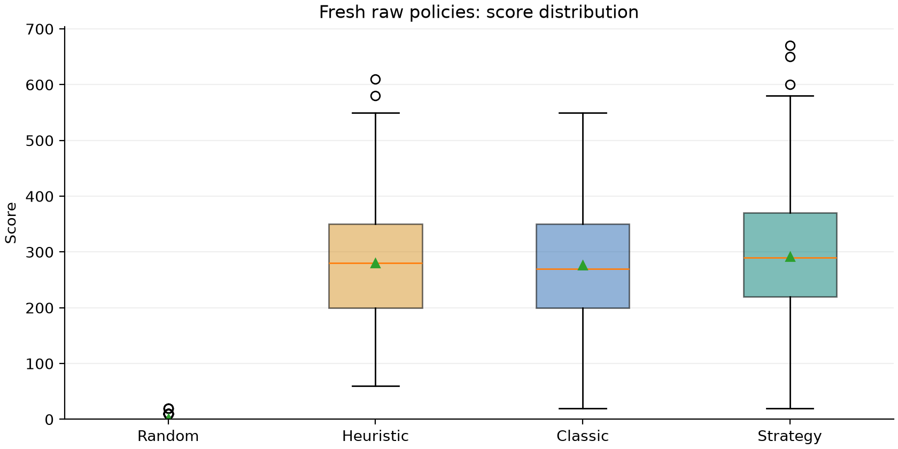

*Figure 4. CURRENT FRESH RE-EVALUATION. 300 episodes per policy across three matched 100-seed blocks. Boxes show median and quartiles; triangles show means. Source: `raw_episodes.csv`.*

Classic's mean score was 276.07; Strategy's was 291.90. The heuristic baseline's mean was 279.97. The individual score distributions overlap substantially. The result does not show that a raw learned policy fills the board. All per-episode records, including low-scoring runs, remain in `raw_episodes.csv`.

<!-- pagebreak -->

# 10. Survival and action frequency

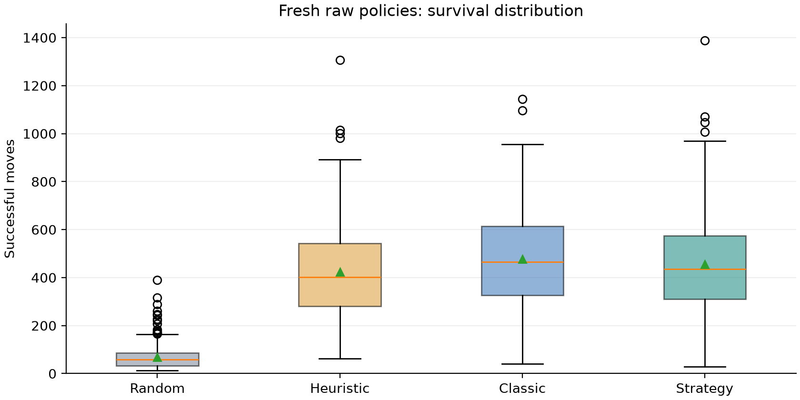

*Figure 5. CURRENT FRESH RE-EVALUATION. 300 episodes per policy across three matched 100-seed blocks. Boxes show median and quartiles; triangles show means. Source: `raw_episodes.csv`.*

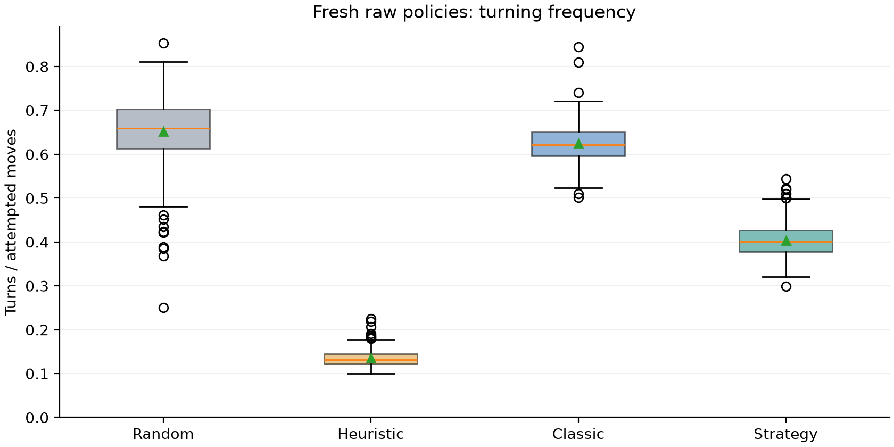

*Figure 6. CURRENT FRESH RE-EVALUATION. 300 episodes per policy across three matched 100-seed blocks. Boxes show median and quartiles; triangles show means. Source: `raw_episodes.csv`.*

Strategy's mean turn ratio was 40.33% versus 62.45% for Classic, consistent with the implemented turn penalty but not causal proof from this unequal-training comparison. Longer survival does not necessarily imply more food: Classic survived longer on average while scoring less in this sample. [Source: `raw_episodes.csv`.]

<!-- pagebreak -->

# 11. Sampling uncertainty and seed blocks

| Policy | 500000-500099 | 501000-501099 | 502000-502099 | SD of 3 block means |
| --- | --- | --- | --- | --- |
| Random | 1.10 | 1.90 | 0.70 | 0.61 |
| Heuristic | 276.50 | 291.40 | 272.00 | 10.15 |
| Classic | 286.70 | 282.50 | 259.00 | 14.93 |
| Strategy | 295.60 | 294.00 | 286.10 | 5.09 |

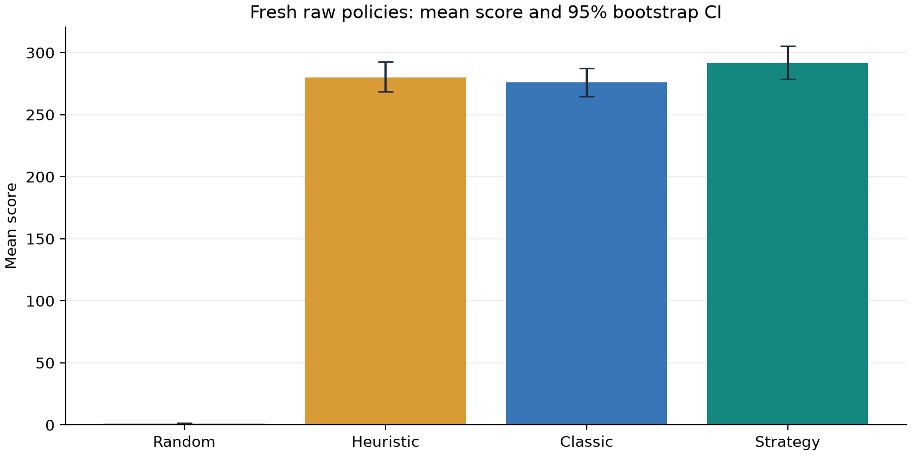

*Figure 13. Percentile bootstrap confidence intervals: 2,000 resamples, seed 9152026. Intervals describe held-out episode sampling for the fixed models, not training-seed variation. Source: `raw_episodes.csv`.*

The paired mean Strategy-minus-Classic score difference was 15.83, with interval [-1.80, 33.83]. Because zero lies within this interval, these runs do not support a strong claim of score superiority. The interval concerns these fixed models and this seed-sampling procedure. It does not include checkpoint selection, training-seed variability or distribution changes. No significance claim is made for the multiple exploratory metrics.

<!-- pagebreak -->

# 12. Browser anti-trap results

| Policy | Assist | n | Mean score | SD | Survival | Wins | Step caps |
| --- | --- | --- | --- | --- | --- | --- | --- |
| Random | OFF | 20 | 1.50 | 3.66 | 82.15 | 0 | 0 |
| Random | ON | 20 | 1247.00 | 59.39 | 3000.00 | 0 | 20 |
| Heuristic | OFF | 20 | 282.50 | 106.86 | 430.30 | 0 | 0 |
| Heuristic | ON | 20 | 1237.00 | 47.36 | 3000.00 | 0 | 20 |
| Classic | OFF | 20 | 311.50 | 124.36 | 552.40 | 0 | 0 |
| Classic | ON | 20 | 1273.00 | 51.51 | 3000.00 | 0 | 20 |
| Strategy | OFF | 20 | 281.00 | 91.47 | 443.70 | 0 | 0 |
| Strategy | ON | 20 | 1288.00 | 63.13 | 3000.00 | 0 | 20 |

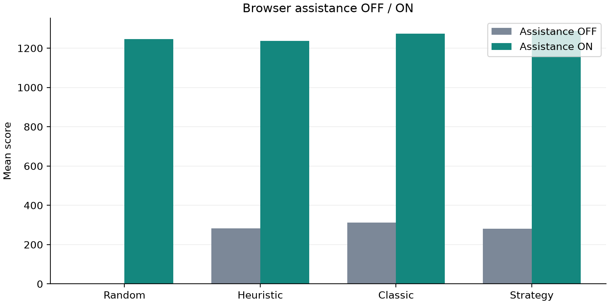

*Figure 7. CURRENT FRESH RE-EVALUATION. 20 matched browser seeds per condition; 3,000 attempted-step cap. These are separate from the Gymnasium raw-policy protocol. Surviving to the cap is not a win. Source: `safety_episodes.csv`.*

Assistance substantially changes the available information and action selection. Comparisons within this table use the same browser seed protocol, but they should not be combined with raw Gymnasium tables. Reaching the step cap denotes survival to the experiment horizon, not board completion. [Source: `safety_episodes.csv`.]

<!-- pagebreak -->

# 13. Assistance survival and raw failure categories

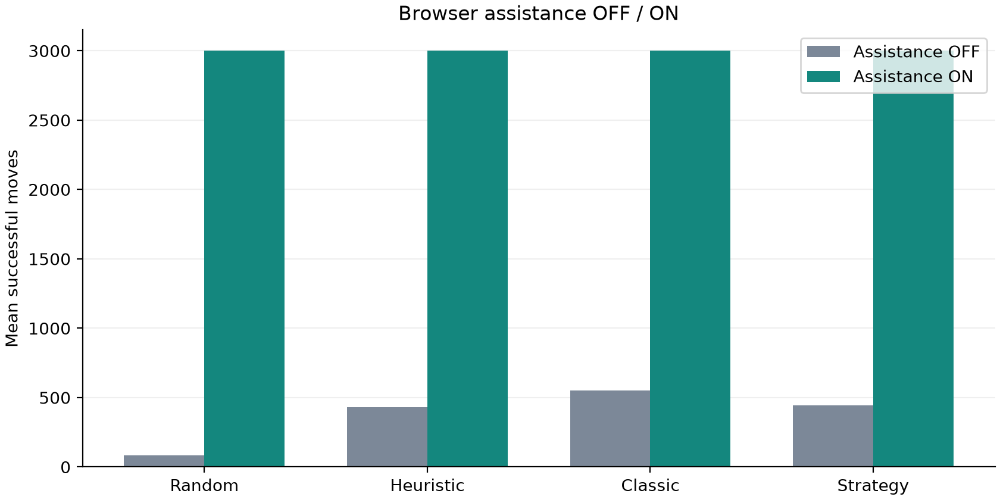

*Figure 8. CURRENT FRESH RE-EVALUATION. 20 matched browser seeds per condition; 3,000 attempted-step cap. These are separate from the Gymnasium raw-policy protocol. Surviving to the cap is not a win. Source: `safety_episodes.csv`.*

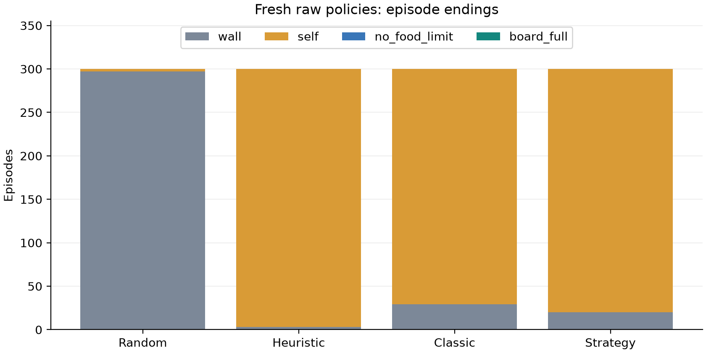

*Figure 12. Raw policy termination categories, 300 episodes per policy; successful survival and attempted steps differ by one on collisions. Source: `raw_episodes.csv`.*

The first plot concerns the 20-seed browser assistance protocol; the second concerns the 300-seed raw Python protocol. The two denominators and stopping conditions differ deliberately. Both are shown to distinguish successful survival from full-board completion and to retain actual failure categories. [Source: CSV filenames in captions.]

<!-- pagebreak -->

# 14. Ultimate results

| Metric | Old controller | Fixed controller |
| --- | --- | --- |
| Episodes | 20 | 20 |
| Reached >50% | 20 | 20 |
| Genuinely locked | 9 | 20 |
| Full-board wins | 9 | 20 |
| Mean score | 3847.00 | 3970.00 |
| Mean maximum occupancy (%) | 96.92 | 100.00 |
| Mean attempted moves | 25956.45 | 16838.15 |
| Ordered moves (total) | 54234 | 198316 |
| Recovery moves (total) | 333626 | 7178 |
| Repeated states (total) | 102144 | 0 |
| Largest detected recurrence period | 388 | 0 |
| Repeated ordered states | 0 | 0 |
| Ordered progress errors | 0 | 0 |
| Unexpected ordered fallbacks | 0 | 0 |
| Collisions after >50% | 0 | 0 |
| No-food endings after >50% | 11 | 0 |
| Mean >50%-to-win moves, winners only | 9695.67 | 10274.70 |

All final runs reached length 400 and score 3,970. The corrected controller used 198,316 ordered moves and 7,178 recovery moves in total. No repeated state, ordered advancement violation, unexpected ordered fallback or collision was recorded. These are observed properties of the tested runs. Because the seeds informed development, the result should be interpreted as successful regression coverage rather than an untouched estimate of general win probability. [Source: `ultimate_final.json`.]

<!-- pagebreak -->

# 15. Dense-board completion and progression

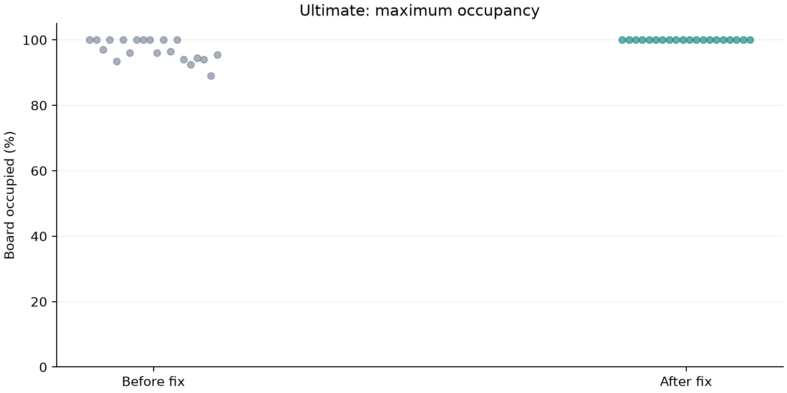

*Figure 9. Maximum occupancy for each of 20 matched seeds, with deterministic horizontal jitter for overlapping points. Source: `ultimate_before_episodes.csv; ultimate_after_episodes.csv`.*

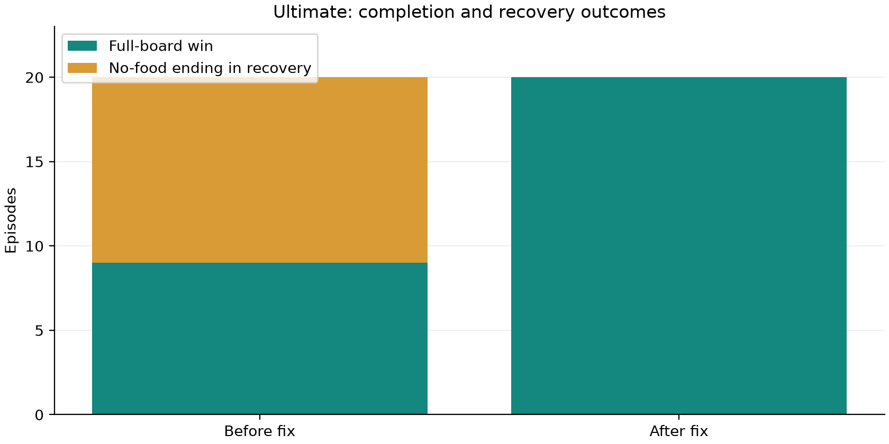

*Figure 10. All episodes reached >50%. Each ending is classified from the actual engine/evaluator result; step-limit survival is never a win. Source: `ultimate_before_episodes.csv; ultimate_after_episodes.csv`.*

The old controller often reached high occupancy without completion. Maximum occupancy alone would have hidden the 11 no-food failures. The completed-board count and explicit recovery/lock distinction are therefore necessary outcome measures. [Source: before/after episode CSVs.]

<!-- pagebreak -->

# 16. Case study, negative results and latency

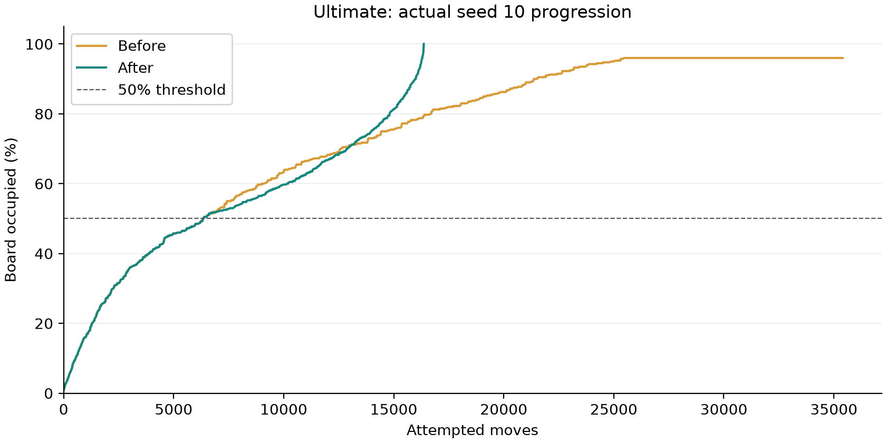

*Figure 11. Seed 10 was selected as the first investigated failing seed, not as a representative success. Traces are sampled every 100 moves and at food/mode transitions. Source: `ultimate_before_verified.json; ultimate_final.json`.*

Seed 10 illustrates the failure investigated first. Its original run repeated an unordered recovery state and ended at the no-food cutoff. The repaired run aligns before dense recovery becomes permanent and subsequently fills the board. This example accompanies, rather than replaces, the full twenty-seed table.

Additional probes started directly from all eleven old near-full loop snapshots. Only two ate within 1,600 simulated moves; nine remained without food, and none collided. These snapshots are harder than normal-play transition states and demonstrate that the implemented search is not a universal rescue procedure. They remain under `fixtures/` with the probe log. [Source: `scripts/probe-fixtures.cjs`; `logs/fixture-probe-final.log`.]

The final twenty episodes took 61.58 seconds of measured episode wall time in aggregate. The largest individual decision was 1671.22 ms. Search runs synchronously on the browser thread and can delay responsiveness; background/worker search is proposed future work. Concurrent local tests affected timings, so no controlled throughput or speedup claim is made. [Source: `ultimate_final.json`.]

<!-- pagebreak -->

# 17. Tests, invariants and parity

Three consecutive full passes each completed **64 Python tests and 97 JavaScript tests**, with no failures. Two additional deterministic runs each passed all 10 Ultimate regression tests. A fourth final full pass also passed 64 Python and 97 JavaScript tests, recorded separately in `tests_final.json`. The JavaScript suite includes DOM/Canvas-stub integration tests for the shipped browser scripts; the shipped headless runner also executed 20 heuristic episodes. [Source: `results/full_recheck_2026_09_15/tests_main.json`, `tests_final.json`, `logs/regression-extra-1.log`, `logs/regression-extra-2.log`, `headless_smoke.json`; `scripts/recheck_tests.py`.]

A separate real-browser smoke test discovered the three models, loaded Ultimate, played with assistance in headless mode, displayed a full-board win (score 3,970, length 400, 397 foods, 17,175 successful moves), and restored board rendering. No console warnings/errors were captured. This unseeded UI check is excluded from fixed-seed experiment statistics. [Source: `results/full_recheck_2026_09_15/browser_smoke.json`, observed browser UI.]

The new tests cover 2,500 aligned food placements (lengths 201,250,300,350,399; five head indices; every unoccupied food cell), 25 growth-to-full-board trajectories, legal tail departure, wraparound, reset/pending behavior and safe recovery without a false lock. The production-engine seed-10 regression **fails on the preserved old implementation and passes on the fixed implementation**. Failed development tests and evaluator corrections are retained in `logs/` and `experiment_notes.json`. [Source: `tests/ultimate-regression.test.cjs`; `logs/regression-old-final.log`; final suite logs.]

All three actual trained checkpoints were compared on 1,000 identical snapshots each: observations and greedy actions matched exactly. Maximum absolute Q differences were 0.00000191 (Classic) and 0.00000572 (Strategy/Ultimate). The trained-model check uses rtol=1e-5, atol=1e-5; the original random-network unit test retains its stricter atol=1e-6. [Source: `scripts/recheck_raw.py`, `parity`; `trained_parity.json`; `rl/test_browser_dqn.py`.]


## Verification boundaries

Constructed-state tests use independently enumerated route cells and shared production collision rules. The separate production-engine regression exercises real food spawning and termination. The exhaustive food-placement tests protect successor progress and growth independently of the historical seed-10 failure. The browser suite exercises controller/renderer integration with deterministic stubs; manual local browser checks additionally verify model discovery, loading and advancing statistics. Tests cannot prove global completeness of the bounded search.

## Development corrections

The first trained-checkpoint parity attempt used an overly tight absolute tolerance near zero; exact actions still required independent verification and subsequently matched. An initial recurrence counter updated its map too early, and an early ordered food-bound check counted recovery time. Corrected before/after runs replace those pilots only in published tables; all pilot files remain explicitly classified. The legacy recovery fixture limit was changed from one lap to two after observing the valid join-then-food path. No aligned food-bound assertion was relaxed. [Source: `experiment_notes.json` and retained logs.]

<!-- pagebreak -->

# 18. Historical training curves

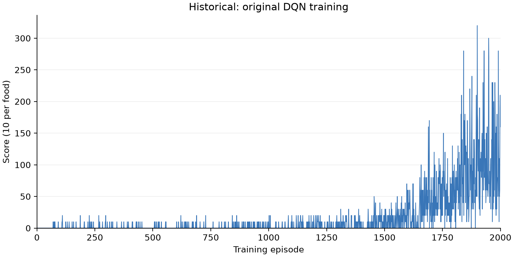

*Figure 1. HISTORICAL / ORIGINAL EXPERIMENT. Regenerated from the original 2,000-episode CSV; no retraining. Source: `results/training.csv`.*

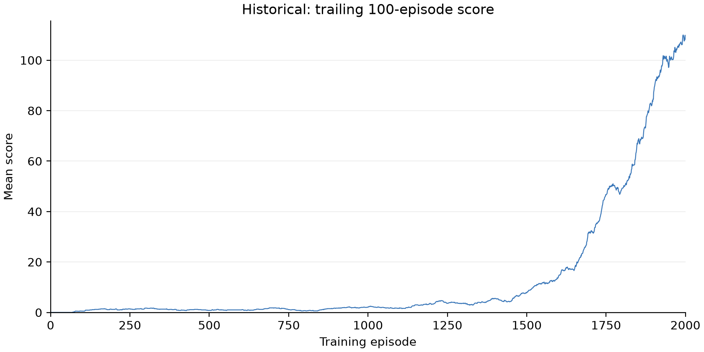

*Figure 2. HISTORICAL / ORIGINAL EXPERIMENT. Regenerated from the original 2,000-episode CSV; no retraining. Source: `results/training.csv`.*

These figures redraw the original 2,000-episode training CSV. They do not represent new optimization, and their curves must not be interpreted as training trajectories of the controller repair. The checkpoint remains frozen throughout the fresh evaluations. [Source: `results/training.csv`, `training_status.json`.]

<!-- pagebreak -->

# 19. Historical returns and validation context

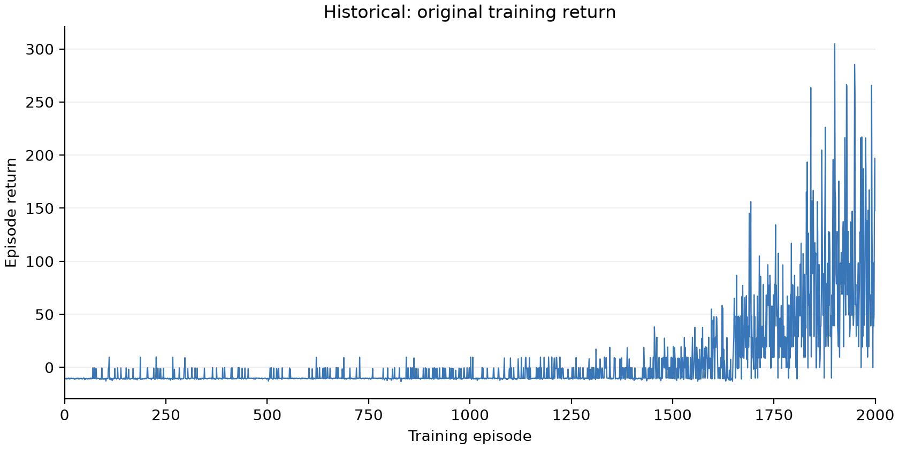

*Figure 3. HISTORICAL / ORIGINAL EXPERIMENT. Regenerated from the original 2,000-episode CSV; no retraining. Source: `results/training.csv`.*

Training return includes food, step costs and collision costs. It is distinct from the food-based score used in evaluation tables. The original trainer validated every 100 episodes on twenty seeds starting at 100000 and retained the best validation checkpoint plus the latest checkpoint. Its training seeds were episode-specific, starting at 42. [Source: `rl/dqn/train.py`, `train`; `results/run_config.json`, `validation.json`.]

The historical original 100-episode evaluation produced DQN mean score 306.30, Heuristic 279.00 and Random 1.40. The fresh means differ because the held-out seeds differ; old values are not stale measurements to be overwritten. Historical Strategy continuation scores and the later browser experiments likewise remain separate protocols. [Source: `results/evaluation.json`, `results/strategy_v1_experiment/comparison.json`.]

<!-- pagebreak -->

# 20. Local language-model experiment

The implemented agent is a local, text-only Ollama client, not a locally implemented transformer architecture. The configured tag is `qwen3.8:27b-q4_K_M`; saved Ollama metadata identifies family `qwen35`, 27.3B parameters and Q4_K_M quantization. The repository does not establish the underlying transformer's layer architecture or validate the tag as an official model release name. [Source: `rl/llm_agent.py`, `LLMAgent`; `results/llm_experiment/config.json`, saved model metadata.]

`structured_state` converts the numeric observation into three boolean danger flags, an absolute food-direction category, and the current direction. It omits food distance magnitude, no-food fraction, full body, pixels and history. The system prompt requests one relative move, explains left/right/straight and dangers, and prefers straight when tied. The user message is compact JSON; for example `{"danger_straight":false,"danger_left":true,"danger_right":false,"food_direction":"upper_right","current_direction":"right"}` illustrates the schema, not a measured decision. Output must be exactly `{"action":"STRAIGHT"}`, `{"action":"LEFT"}` or `{"action":"RIGHT"}`. [Source: `structured_state`, `SYSTEM_PROMPT`, `ACTION_SCHEMA`, `LLMAgent.choose_action`.]

Requests use `/api/chat`, no streaming, `think:false`, temperature 0, seed, 32 generated-token limit, context 2,048 and keep-alive 5 minutes. The client checks installed local GGUF weights, loopback-only addresses, no redirects/proxy and no automatic download. Validation rejects duplicate/extra keys, invalid enum/type, malformed JSON, incomplete or token-limited responses. Request failures or invalid outputs fall back to the first safe relative action in straight/left/right order, then straight if all blocked. A valid but dangerous model action executes unchanged. [Source: `OllamaClient`, `validate_action`, `safe_fallback`, `LLMAgent.choose_action`.]

**HISTORICAL / ORIGINAL EXPERIMENT only:** the 600-second Qwen budget completed one episode and part of another. The completed episode scored 10 with 412 successful moves and a no-food ending. Across 459 attempted decisions, average latency was 1,307.12 ms; 458 were valid and one request failed. The failed final request's fallback was recorded but not stepped after budget expiry. Baselines completed 50 episodes each (seeds 300000-300049): Random mean 2.00, Heuristic 264.80, DQN 283.40. On the single matched completed seed, their scores were 0, 70 and 230 versus Qwen's 10. This is insufficient for a reliable ranking of Qwen. No fresh Qwen inference was performed in this recheck. [Source: `results/llm_experiment/comparison.json`, `episodes.csv`, `Qwen_decisions.jsonl`; `rl/evaluate_llm.py`.]


The architecture claim here concerns the agent wrapper and inference protocol. It does not infer unrecorded internals of a model from its display tag. A future comparison should provide more completed matched episodes and account separately for invalid output, request timeout and valid but poor decisions. Such a fresh comparison was not run in this task.

<!-- pagebreak -->

# 21. Discussion, limitations and conclusions

The DQN input is partially observed; distant body geometry is absent. Full-board planner results cannot be credited to learned reasoning. Only one original training seed and its continuation are represented, and evaluation blocks are not independent training replications. Classic has 2,000 training episodes while Strategy has 2,300, so this frozen-checkpoint comparison does not isolate reward shaping from extra training. [Source: `SnakeEnv._observation`; checkpoint metadata; `protocol.json`.]

The 20 Ultimate seeds were used during development and are regression evidence, not an untouched holdout estimate. Although all final episodes won, there is no universal recovery guarantee: 9 of 11 already near-full old loop snapshots did not eat within a 1,600-step diagnostic, while all stayed collision-free. The bounded search may fail, its body-only deduplication sacrifices search completeness, and its synchronous execution can delay rendering. Maximum measured decision latency was 1,671.22 ms in the final 20 episodes under concurrent test workload; this is an observed run maximum, not a platform performance guarantee. [Source: `logs/fixture-probe-final.log`; `scripts/probe-fixtures.cjs`; `ultimate_final.json`; `joinPlan`.]

Python uses NumPy food RNG; JavaScript uses FNV-1a seed hashing followed by Mulberry32. Equal numeric seed values do not produce equal cross-language episodes. The parity test compares identical snapshots, not independent food streams. Qwen has only historical, budget-limited evidence. Asynchronous planner execution, broader untouched Ultimate seed sets, independent training replications and guaranteed recovery from arbitrary dense bodies are future work, **not implemented or demonstrated** here. [Source: `SnakeEnv._spawn_food`, `js/game.js:randomGenerator`; `trained_parity.json`; `experiment_notes.json`.]


## Conclusions

The raw policies provide a measured baseline for a compact-feature DQN, while the stronger assisted outcomes demonstrate the contribution of explicit planning. The Ultimate repair addresses a reproducible transition/recovery failure without changing the learned model. Its ordered-state invariant is exercised extensively, and its known failure boundary is retained rather than hidden. The principal engineering result is a tested, instrumented controller with reproducible evidence, not a claim that DQN learned a guaranteed full-board solution.

## Future work - not implemented

Evaluate untouched Ultimate seeds, train independent matched-budget Classic/Strategy replications, move recovery search off the UI thread, compare alternative completeness/latency tradeoffs, and improve diagnostics for search exhaustion. A richer learned observation or recurrent policy would be a separate experiment with a changed baseline, not a silent extension of the current evaluation.

<!-- pagebreak -->

# Appendix A. Checkpoints and reproducibility

**Classic**: `models/classic/2026-09-10_21-39-17-351796_ep2000.pt`

SHA-256: `14defd74f5b5907cfd6317989754526f735a743211d3944082f6df6eba69a95b`

**Strategy**: `models/strategy/2026-09-11_00-27-06-910520_ep2300.pt`

SHA-256: `42a4c255456ffd5285b04fd2c7dacd582e9e4cd50d9022e347e8043ea16f3141`

**Ultimate**: `models/ultimate/2026-09-12_01-30-56-963414_ep2300.pt`

SHA-256: `a407513272f41a31566ca0acb4ff64aca17bdf016d7132c2a95e44de4cd2f524`

The active checkpoints were verified byte-for-byte against the initial manifest. No optimizer steps were run during re-evaluation. The Strategy and Ultimate online tensors were checked for exact equality; their metadata and serialization differ. [Source: `metadata.json`; `audit_recheck.py`.]

## Artifact map

- `raw_episodes.csv`: all 1,200 raw-policy episodes.
- `safety_final.json`, `safety_episodes.csv`: all 160 browser assistance episodes.
- `ultimate_before_verified.json`, `ultimate_final.json`: definitive twenty-seed before/after runs and time traces.
- `ultimate_before_episodes.csv`, `ultimate_after_episodes.csv`: exported per-episode telemetry.
- `summary.json`: derived statistics, software, hashes, seeds, tests and figure paths.
- `figure_manifest.json`, `figures/`: thirteen plots in PNG and PDF.
- `baseline/`, `historical_hashes.json`: original README/controller/test files and history-integrity manifest.
- `experiment_notes.json`, `logs/`: pilot classification, negative results, corrections and full test output.
- `reports/`: this PDF and editable Markdown.

All experiment paths above are under `results/full_recheck_2026_09_15/`, except `reports/`. Recompute figures and documents from the preserved raw data; choose a new directory to rerun experiments. The final Git commit containing this report can be identified using `git log -1 -- reports/Pixel_Snake_RL_Reevaluation_and_Ultimate_Control_Report.pdf`; a file cannot embed its own containing commit hash without changing it.

<!-- pagebreak -->

# Appendix B. Commands

```powershell
# From the repository root; Python 3.12 and Node 24 were used.
python -m venv .venv
.venv/Scripts/python.exe -m pip install -r rl/requirements.txt
.venv/Scripts/python.exe -m rl.web_server --port 8765
# Open http://127.0.0.1:8765 ; select DQN + checkpoint and optional assistance.

# Reproduce frozen evaluation into a NEW directory (existing data is protected).
$run = 'results/my_recheck'
New-Item -ItemType Directory -Force $run
Copy-Item results/full_recheck_2026_09_15/protocol.json $run
Copy-Item results/full_recheck_2026_09_15/metadata.json $run
Copy-Item results/full_recheck_2026_09_15/*_weights.json $run
.venv/Scripts/python.exe -B scripts/recheck_raw.py $run
node scripts/evaluate-browser.cjs $run safety final
node scripts/evaluate-browser.cjs $run ultimate final
# Before-controller comparison uses the preserved source, not git checkout.
$env:SNAKE_SAFETY_SOURCE=(Resolve-Path results/full_recheck_2026_09_15/baseline/js/safety.js).Path
node scripts/evaluate-browser.cjs $run ultimate before_verified
Remove-Item Env:SNAKE_SAFETY_SOURCE

# Test commands (the recorder additionally saves separate per-pass logs).
.venv/Scripts/python.exe -B -m unittest discover -s rl -p 'test_*.py'
node --test tests/*.test.cjs
node --test tests/ultimate-regression.test.cjs
node scripts/headless.cjs heuristic 20 3000 recheck-smoke

# Regenerate the checked-in figures, summary, README and editable report.
.venv/Scripts/python.exe -B scripts/generate_report_figures.py
.venv/Scripts/python.exe -B scripts/build_recheck_documents.py
# PDF rendering uses reportlab==4.4.9; verification uses pypdf==6.10.0.
.venv/Scripts/python.exe -m pip install reportlab==4.4.9 pypdf==6.10.0
.venv/Scripts/python.exe scripts/render_recheck_report.py
.venv/Scripts/python.exe scripts/verify_report_pdf.py
.venv/Scripts/python.exe -B scripts/audit_recheck.py
```


To run the recorded full-suite sequence, use `scripts/recheck_tests.py --rounds 3 --label NEW_LABEL`; choose a new label because existing records are protected from overwrite. The original pre-fix functional failure is reproduced by setting `SNAKE_SAFETY_SOURCE` to the preserved baseline and running only the test named `recorded seed 10 completes` in `ultimate-regression.test.cjs`. An old-controller failure there is expected evidence, not a successful suite result.

<!-- pagebreak -->

# References and evidence index

[1] Mnih, V., Kavukcuoglu, K., Silver, D., et al. (2015). Human-level control through deep reinforcement learning. Nature 518, 529-533. https://doi.org/10.1038/nature14236

[2] Ng, A. Y., Harada, D., and Russell, S. (1999). Policy invariance under reward transformations: Theory and application to reward shaping. ICML, 278-287. https://people.eecs.berkeley.edu/~russell/papers/icml99-shaping.pdf

## Implementation evidence

Environment and observations: `rl/snake_env.py`, `SnakeEnv`; browser rules: `js/game.js`, `SnakeGame`. DQN: `rl/dqn/model.py`, `QNetwork`; `rl/dqn/agent.py`, `DQNAgent`; `rl/dqn/replay_buffer.py`, `ReplayBuffer`. Reward: `rl/strategy_reward.py`, `potential`, `StrategyReward`. Profiles: `rl/model_profiles.py`. Planner and recovery: `js/safety.js`, `safeFoodPath`, `joinPlan`, `SafetyGuard`. Local language model: `rl/llm_agent.py` and `rl/evaluate_llm.py`.

## Fresh numerical evidence

The authoritative input set is declared in `summary.json: definitive_inputs`. `scripts/generate_report_figures.py` produces all aggregate tables and figures from those inputs. `scripts/build_recheck_documents.py` inserts those same numbers into the README and report source. `scripts/audit_recheck.py` checks input counts, model/history hashes, local documentation links, figure reproducibility and document consistency. Full test logs are preserved separately from statistical results.

## Historical evidence

`results/training.csv`, `training_status.json`, `run_config.json`, `validation.json`, `evaluation.json`; `results/strategy_v1_experiment/`; `results/llm_experiment/`; original README under the recheck baseline directory. Older source and model filenames in these immutable historical files refer to their original run context and are not silently rewritten.
